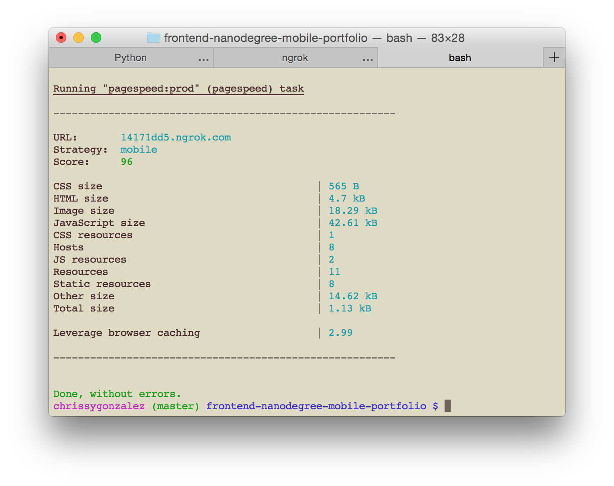
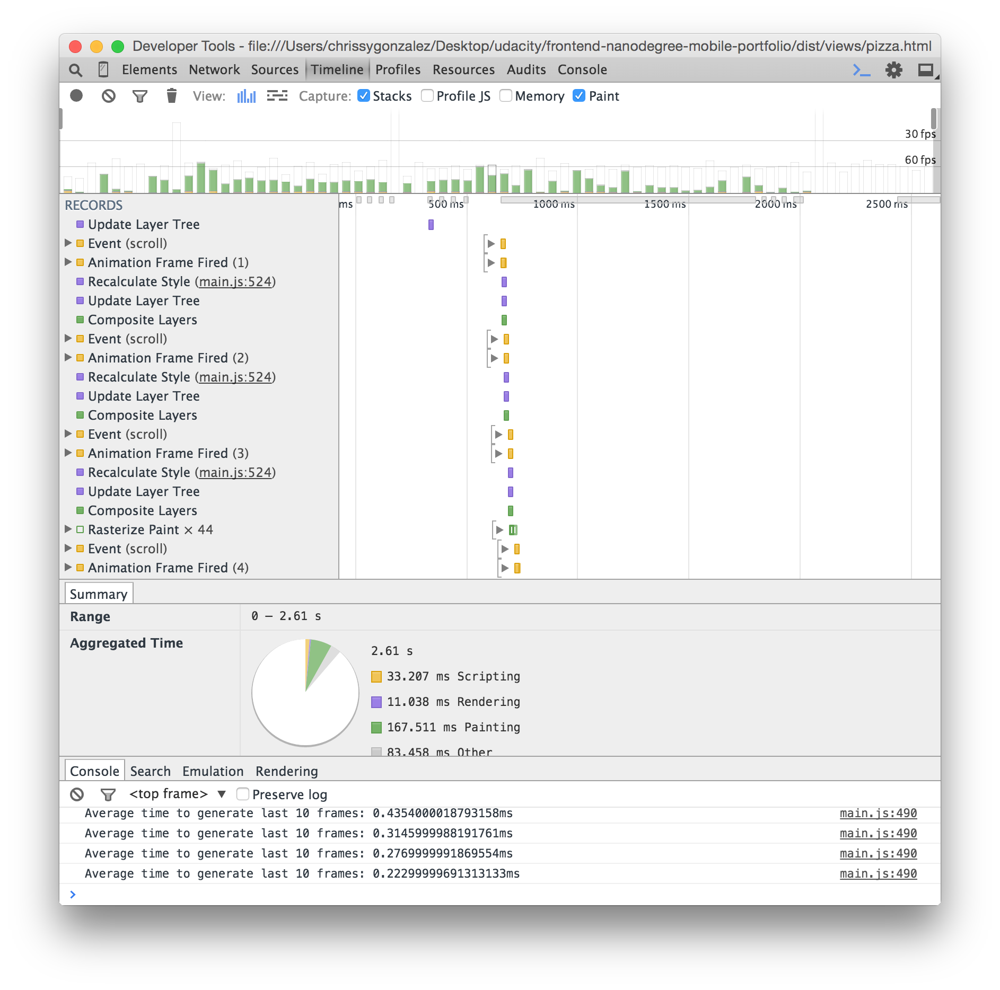
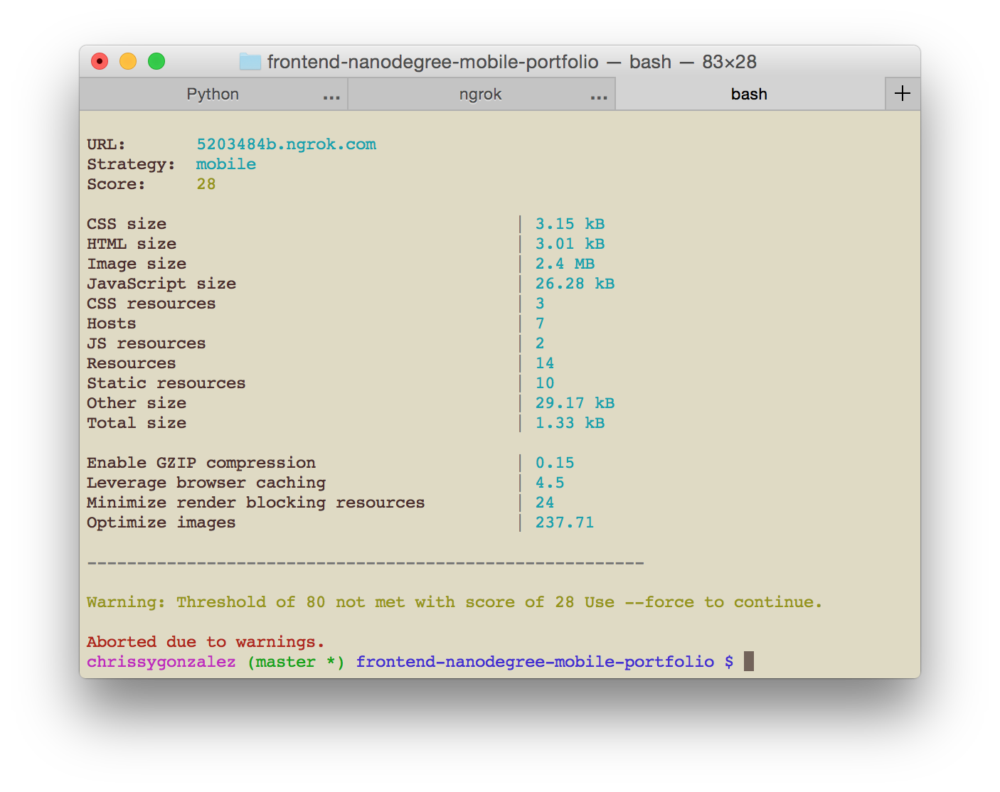
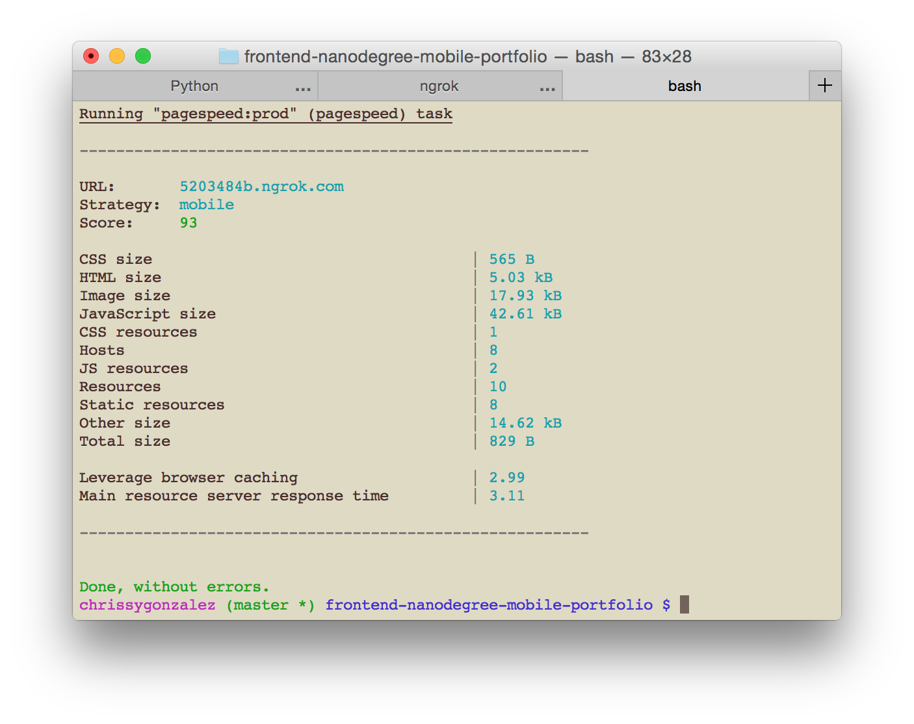

# Project 4
###Update: v2, based on code review
####What Changed?
- Learned how to minify/include js/css files as part of Grunt workflow.
- Made suggested code changes from review.
- Improved commenting style for optimization comments.

####Optimization Results
PageSpeed results seem to have improved a little.

Pizza scrolling seems pretty similar.

###Part 1: PageSpeed Insights
####How to Use
- Download or clone this repository. 
- Start a web server and run the index page in frontend-nanodegree-mobile-portfolio on a local server.
- Use ngrok to make the local server available as an outside url.
- If you don't have Grunt installed, install it and then install the grunt-pagespeed plugin.
- Add grunt-pagespeed to the Gruntfile.
- Run grunt-pagespeed on the ngrok url by typing 'grunt pagespeed' in the terminal.
- This index page usually scores above 90.
- Compare to the original index file in _original/frontend-nanodegree-mobile-portfolio, which scores in the high 20s.

####Optimizations Used
- Moved CSS to the head of index.html to minimize external resources.
- Used the Javascript code from Google Fonts to include Open Sans asynchronously.
- Added 'async' to Google Analytics script tag to load it asynchronously.
- Included perfmatter.js in head instead of as external file.
- Reduced physical size of images and optimized to smallest size possible.
- Minified HTML.

####Optimization Results
The original version without any improvements.

The optimized version often scores above 90.

####Resources Used
- [Getting started with Grunt](http://gruntjs.com/getting-started)
- [Small Grunts](https://corner.squareup.com/2013/08/small-grunts.html)
- [Setting up PageSpeed for Gulp](http://una.im/gulp-local-psi/#💁)
- [Automating Web Performance](https://developers.google.com/web/updates/2014/06/Automating-Web-Performance-Measurement?hl=en)
- [grunt-pagespeed on GitHub](https://github.com/jrcryer/grunt-pagespeed)
- [psi on GitHub](https://github.com/addyosmani/psi/)
- [Load Google Fonts Asynchronously](http://www.lockedowndesign.com/load-google-fonts-asynchronously-for-page-speed/)

###Part 2a: Pizza.html Pizza Resizing
####How to Use
- Download or clone this repository if you haven't already. 
- Open the frontend-nanodegree-mobile-portfolio folder. 
- Within the views folder, find pizza.html and open it in a browser.
- Wait for the page to load, then use the slider to make the pizzas bigger or smaller.
- Open the console (in developer tools) and observe the 'Time to resize pizzas'. On my machine, the optimized version takes around 0.42ms.
- Compare to the original (in _original > frontend-nanodegree-mobile-portfolio > views > pizza.html). On my machine, the original takes around 84.64ms to resize pizzas.

####Optimizations Used
- Changed querySelectorAll to getElementsByClassName.
- Saved reference to the pizzaContainers instead of searching for them within the loop.
- Deleted the whole determineDx function and used sizeSwitcher to set percentage size for the pizzas instead.

###Part 2b: Pizza.html Scrolling
####How to Use
- Download or clone this repository if you haven't already. 
- Open the frontend-nanodegree-mobile-portfolio folder. 
- Within the views folder, find pizza.html and open it in a browser.
- Wait for the page to load, then scroll up and down to see the improved frame rate.
- Compare to the original (in _original > frontend-nanodegree-mobile-portfolio > views > pizza.html) and use developer tools to see the exact effect the optimizations have had.

####Optimizations Used
The optimization process was a long and winding one, and I backed up and moved forward so many times, it was hard to remember what order I tried these in. Here, I'm documenting the effect each optimization had in a top to bottom order (in the code), but I think I probably followed the order recommended in the office hours video and/or the original ReadMe file.

The original version without any improvements.
  

This is the result of changing querySelectorAll to getElementsByClass in updatePositions. It seems pretty similar to the original, but the bars after the really tall ones do get shorter.
  

Pulled scrollTop out of loop and saved to a variable, which made a huge difference in scripting and rendering. Still quite a lot of green, especially with faster scrolling (this shows a fairly slow scroll).
  

Tried translateX instead of changing the left property of the pizzas. Seems to have made things worse if you look at the bars, but the painting time on the pie chart has gone down by about 150ms.
  

Added a null transform to get the pizzas onto their own composite layers. Painting speed has slowed down again, but the bars are shorter and seem a little more spaced out.
  

When I was looking for ways to reduce paint time, I saw advice against attaching things to the scroll event, since it can fire so frequently. It seemed like throttling and debouncing were the two things to try, so based on examples of both, I chose to throttle. The first time I tried it, it seemed to make a big difference, but I think I made my optimizations in a different order than I did for these screenshots. In this instance, it's hard to tell if it helped.
  

Reduced number of pizzas significantly. I originally did this earlier in the process and was still left with the big green bars that led me to try other optimizations. But at any point in the process, reducing pizzas made a huge improvement.
  

Made small pizzas instead of scaling with CSS. This just seemed like a good idea, and it did improve time across the board.
  

####Resources Used
Besides the class lectures, here are some of the ways I figured out what improvements could or should be made.
- [The Read Me provided in the original files](https://github.com/udacity/frontend-nanodegree-mobile-portfolio)
- [Discussion forum post](https://discussions.udacity.com/t/stuck-with-painting-and-composition-optimizations/19427/7)
- [Office hours suggestions](https://github.com/udacity/fend-office-hours/tree/master/Web%20Optimization/Effective%20Optimizations%20for%2060%20FPS)
- [MDN scroll event](https://developer.mozilla.org/en-US/docs/Web/Events/scroll)
- [Transform article on CSS Tricks](https://css-tricks.com/almanac/properties/t/transform/)
- [Null transform hack](http://addyosmani.com/blog/be-careful-when-using-null-transform-hacks-to-force-gpu-acceleration/)