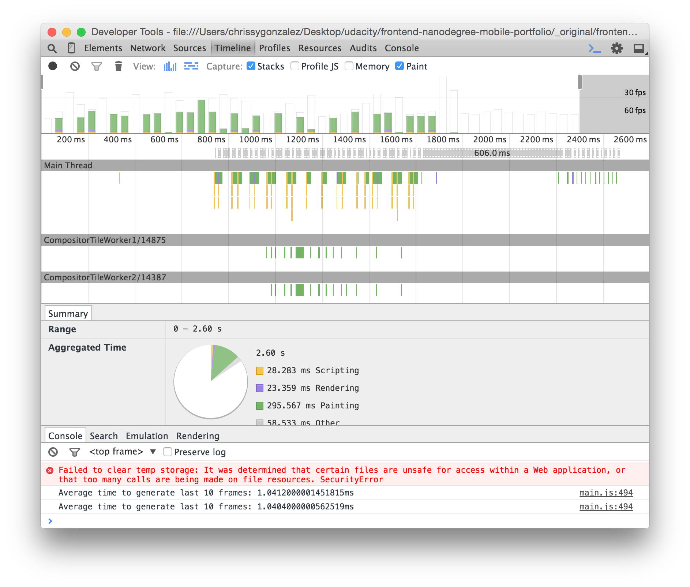

# Project 4
###Part 1: PageSpeed Insights
####Still to do
- use a build tool to minify CSS, JS, and optimize images

###Part 2: Pizza.html
####How to Use
- Download the frontend-nanodegree-mobile-portfolio if you haven't already. 
- Open the frontend-nanodegree-mobile-portfolio folder. 
- Within the views folder, find pizza.html and open it in a browser.
- Wait for the page to load, then scroll up and down to see the improved frame rate.
- Compare to the original (in _original > views > pizza.html) to see the exact effect the optimizations have had.

####Optimizations Used

  
  
  
  
  
  
  
  
  - Pulling variables out of loops
  - Reducing number of pizzas
  - getElementsByClass instead of querySelectorAll
  - Saving scroll position as variable instead of in loop
  - Transform: translateX for pizza movement
  - Transform: translateZ(0) for composite layers
  - Throttling or debouncing scrolling
  - Smaller, unscaled pizza image with better compression

####Resources Used
[The Read Me provided in the original files](https://github.com/udacity/frontend-nanodegree-mobile-portfolio)
[Discussion forum post](https://discussions.udacity.com/t/stuck-with-painting-and-composition-optimizations/19427/7)
[Office hours suggestions](https://github.com/udacity/fend-office-hours/tree/master/Web%20Optimization/Effective%20Optimizations%20for%2060%20FPS)
[MDN scroll event](https://developer.mozilla.org/en-US/docs/Web/Events/scroll)
[Transform article on CSS Tricks](https://css-tricks.com/almanac/properties/t/transform/)
[Null transform hack](http://addyosmani.com/blog/be-careful-when-using-null-transform-hacks-to-force-gpu-acceleration/)